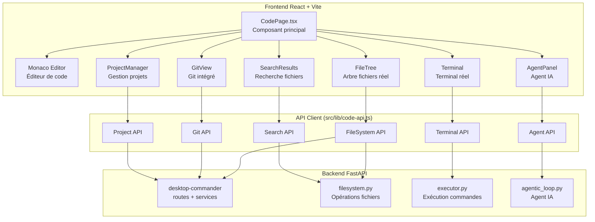
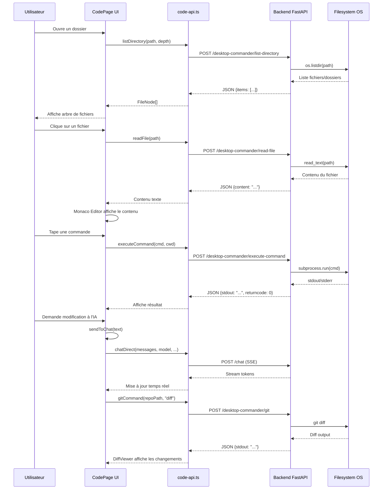

# Plan d'Architecture — Transformation de CodePage en IDE Avancé

## Résumé Exécutif

Transformer [`CodePage.tsx`](src/pages/CodePage.tsx) d'une page avec données simulées en un IDE complet comparable à Claude Code / Codex / Roo Code, avec :
- Accès réel au filesystem local
- Terminal réel avec exécution de commandes
- Éditeur de code avec coloration syntaxique (Monaco Editor)
- Git intégré (clone, commit, push, pull, diff, branches, PR)
- Agent IA avec outils réels (lecture/écriture fichiers, exécution commandes)
- Recherche de fichiers et code intelligence
- Gestion de projets (ouvrir, créer, sauvegarder)

---

## Architecture Globale



---

## Diagnostic de l'Existant

### Ce qui est simulé (à remplacer)

| Fonctionnalité | État Actuel | Solution |
|---|---|---|
| **Arbre de fichiers** | [`defaultTree`](src/pages/CodePage.tsx:59-87) hardcodé (8 fichiers mock) | Appel API `POST /desktop-commander/list-directory` |
| **Contenu des fichiers** | [`sampleFileContents`](src/pages/CodePage.tsx:89-220) hardcodé (4 fichiers mock) | Appel API `POST /desktop-commander/read-file` |
| **Terminal** | [`handleTermCommand`](src/pages/CodePage.tsx:590-610) ne gère que `ls`, `pwd`, `git`, `npm`, `clear` | Appel API `POST /desktop-commander/execute-command` |
| **Agent Steps** | [`simulateAgentSteps`](src/pages/CodePage.tsx:500-538) utilise `setTimeout` aléatoire | Vrai agent avec appels API réels |
| **Diff** | [`sampleDiff`](src/pages/CodePage.tsx:222-231) hardcodé (3 lignes) | `git diff` réel via API |
| **Éditeur** | [`<textarea>`](src/pages/CodePage.tsx:873-879) sans coloration | Monaco Editor (`@monaco-editor/react` déjà installé) |
| **Recherche fichiers** | Input de recherche (ligne 661) ne fait rien | Appel API `POST /desktop-commander/search-files` |

### Ce qui est déjà réel (à conserver)

| Fonctionnalité | Fichier | Statut |
|---|---|---|
| **Chat IA** | [`chatDirect`](src/lib/api.ts:121) via `sendToChat` | Réel — utilise l'API backend |
| **GitHub repos** | [`github-repos.ts`](src/lib/github-repos.ts) + [`RepoPickerModal`](src/pages/CodePage.tsx:299-394) | Réel — utilise GitHub API |
| **Sélection de modèle** | [`ModelSelector`](src/components/ModelSelector.tsx) | Réel |
| **Preview** | [`PreviewPanel`](src/components/code/PreviewPanel.tsx) | Réel |
| **Mémoire** | [`ClaudeMdEditor`](src/components/code/ClaudeMdEditor.tsx) | Réel |
| **Sous-agents** | [`SubAgentPanel`](src/components/code/SubAgentPanel.tsx) | Réel |
| **TaskSidebar** | [`TaskSidebar`](src/components/TaskSidebar.tsx) | Réel |

### Backend existant (déjà prêt)

| Endpoint | Fichier | Utilité |
|---|---|---|
| `POST /desktop-commander/list-directory` | [`desktop_commander.py:126`](backend/app/routes/desktop_commander.py:126) | Lister dossier |
| `POST /desktop-commander/read-file` | [`desktop_commander.py:94`](backend/app/routes/desktop_commander.py:94) | Lire fichier |
| `POST /desktop-commander/write-file` | [`desktop_commander.py:116`](backend/app/routes/desktop_commander.py:116) | Écrire fichier |
| `POST /desktop-commander/execute-command` | [`desktop_commander.py:152`](backend/app/routes/desktop_commander.py:152) | Exécuter commande |
| `POST /desktop-commander/search-files` | [`desktop_commander.py:146`](backend/app/routes/desktop_commander.py:146) | Rechercher fichiers |
| `POST /desktop-commander/get-file-info` | [`desktop_commander.py:141`](backend/app/routes/desktop_commander.py:141) | Infos fichier |
| `POST /desktop-commander/move-file` | [`desktop_commander.py:136`](backend/app/routes/desktop_commander.py:136) | Déplacer fichier |
| `POST /desktop-commander/create-directory` | [`desktop_commander.py:131`](backend/app/routes/desktop_commander.py:131) | Créer dossier |
| `GET /desktop-commander/system-info` | [`desktop_commander.py:166`](backend/app/routes/desktop_commander.py:166) | Infos système |
| `POST /execute/runs` | [`execute.py:23`](backend/app/routes/execute.py:23) | Lancer exécution agent |
| `GET /execute/runs/{id}/stream` | [`execute.py:70`](backend/app/routes/execute.py:70) | Stream agent SSE |

---

## Plan de Transformation en Phases

### Phase 1: Backend — Nouveaux Endpoints API

**Objectif** : Ajouter les endpoints backend manquants pour le terminal temps réel et les opérations Git.

#### 1.1 Endpoint Terminal temps réel (SSE)

**Fichier** : [`backend/app/routes/desktop_commander.py`](backend/app/routes/desktop_commander.py)

Ajouter un endpoint SSE pour le terminal :

```python
@router.post("/execute-command-stream")
async def execute_command_stream(req: ExecuteCommandRequest):
    return StreamingResponse(
        dc.dc_execute_command_stream(req.command, req.shell, req.timeout_ms, req.cwd),
        media_type="text/event-stream",
        headers={"Cache-Control": "no-cache", "X-Accel-Buffering": "no"},
    )
```

**Fichier** : [`backend/app/services/desktop_commander.py`](backend/app/services/desktop_commander.py)

Ajouter la méthode `dc_execute_command_stream` qui exécute une commande et yield les lignes via SSE :

```python
async def dc_execute_command_stream(command: str, shell: str = "powershell", timeout_ms: int = 30000, cwd: str | None = None):
    import asyncio
    shell_cmd = ["powershell", "-Command", command] if shell == "powershell" else ["cmd.exe", "/c", command]
    proc = await asyncio.create_subprocess_exec(
        *shell_cmd,
        stdout=asyncio.subprocess.PIPE,
        stderr=asyncio.subprocess.PIPE,
        cwd=cwd,
    )
    async for line in proc.stdout:
        yield f"data: {line.decode('utf-8', errors='replace')}\n\n"
    async for line in proc.stderr:
        yield f"data: {line.decode('utf-8', errors='replace')}\n\n"
    await proc.wait()
    yield f"data: [exit code: {proc.returncode}]\n\n"
```

#### 1.2 Endpoints Git

**Fichier** : [`backend/app/routes/desktop_commander.py`](backend/app/routes/desktop_commander.py)

Ajouter :

```python
class GitCommandRequest(BaseModel):
    repo_path: str
    command: str  # ex: "status", "diff", "log --oneline -5", "add .", etc.

@router.post("/git")
async def git_command(req: GitCommandRequest):
    return dc.dc_git_command(req.repo_path, req.command)
```

**Fichier** : [`backend/app/services/desktop_commander.py`](backend/app/services/desktop_commander.py)

Ajouter `dc_git_command` qui exécute `git {command}` dans `repo_path` :

```python
def dc_git_command(repo_path: str, command: str) -> dict:
    try:
        result = subprocess.run(
            ["git"] + command.split(),
            cwd=repo_path,
            capture_output=True, text=True, timeout=30,
        )
        return {
            "success": result.returncode == 0,
            "stdout": result.stdout,
            "stderr": result.stderr,
            "returncode": result.returncode,
        }
    except subprocess.TimeoutExpired:
        return {"success": False, "description": "Git command timed out"}
    except Exception as e:
        return {"success": False, "description": str(e)}
```

#### 1.3 Endpoint Projets

**Fichier** : [`backend/app/routes/desktop_commander.py`](backend/app/routes/desktop_commander.py)

Ajouter :

```python
class OpenProjectRequest(BaseModel):
    path: str

@router.post("/open-project")
async def open_project(req: OpenProjectRequest):
    """Ouvre un projet : vérifie que le chemin existe, retourne les infos."""
    return dc.dc_open_project(req.path)
```

---

### Phase 2: Frontend — Service API Client

**Objectif** : Créer un service client unifié pour tous les appels backend.

**Nouveau fichier** : [`src/lib/code-api.ts`](src/lib/code-api.ts)

```typescript
const BASE = 'http://localhost:8000';

// ─── Filesystem ──────────────────────────────────────────
export async function listDirectory(path: string, depth = 1) {
  const res = await fetch(`${BASE}/desktop-commander/list-directory`, {
    method: 'POST',
    headers: { 'Content-Type': 'application/json' },
    body: JSON.stringify({ path, depth }),
  });
  return res.json();
}

export async function readFile(path: string, maxBytes?: number) {
  const res = await fetch(`${BASE}/desktop-commander/read-file`, {
    method: 'POST',
    headers: { 'Content-Type': 'application/json' },
    body: JSON.stringify({ path, max_bytes: maxBytes }),
  });
  return res.json();
}

export async function writeFile(path: string, content: string) {
  const res = await fetch(`${BASE}/desktop-commander/write-file`, {
    method: 'POST',
    headers: { 'Content-Type': 'application/json' },
    body: JSON.stringify({ path, content }),
  });
  return res.json();
}

export async function searchFiles(query: string, path?: string, maxResults = 20) {
  const res = await fetch(`${BASE}/desktop-commander/search-files`, {
    method: 'POST',
    headers: { 'Content-Type': 'application/json' },
    body: JSON.stringify({ query, path, max_results: maxResults }),
  });
  return res.json();
}

// ─── Terminal ────────────────────────────────────────────
export async function executeCommand(command: string, cwd?: string, shell = 'powershell') {
  const res = await fetch(`${BASE}/desktop-commander/execute-command`, {
    method: 'POST',
    headers: { 'Content-Type': 'application/json' },
    body: JSON.stringify({ command, shell, timeout_ms: 30000, cwd }),
  });
  return res.json();
}

export function executeCommandStream(
  command: string,
  onData: (line: string) => void,
  onDone: () => void,
  onError: (err: string) => void,
  cwd?: string,
): AbortController {
  const controller = new AbortController();
  // SSE via EventSource ou fetch streaming
  // ...
  return controller;
}

// ─── Git ─────────────────────────────────────────────────
export async function gitCommand(repoPath: string, command: string) {
  const res = await fetch(`${BASE}/desktop-commander/git`, {
    method: 'POST',
    headers: { 'Content-Type': 'application/json' },
    body: JSON.stringify({ repo_path: repoPath, command }),
  });
  return res.json();
}

// ─── Projets ─────────────────────────────────────────────
export async function openProject(path: string) {
  const res = await fetch(`${BASE}/desktop-commander/open-project`, {
    method: 'POST',
    headers: { 'Content-Type': 'application/json' },
    body: JSON.stringify({ path }),
  });
  return res.json();
}
```

---

### Phase 3: Frontend — Monaco Editor

**Objectif** : Remplacer le `<textarea>` par Monaco Editor avec coloration syntaxique.

**Fichier** : [`src/pages/CodePage.tsx`](src/pages/CodePage.tsx)

Remplacer les lignes 871-886 :

```tsx
// AVANT (simulé) :
<textarea
  value={fileContent}
  onChange={(e) => setEditableContent(e.target.value)}
  className="absolute inset-0 w-full h-full bg-transparent ..."
  spellCheck={false}
/>
<div className="absolute left-0 top-0 p-3 pr-2 pointer-events-none select-none">
  {fileContent.split('\n').map((_, i) => (
    <div key={i} className="text-right ...">{i + 1}</div>
  ))}
</div>

// APRÈS (Monaco Editor) :
import Editor from '@monaco-editor/react';

<Editor
  height="100%"
  language={monacoLanguageForExtension(currentLanguage)}
  value={fileContent}
  onChange={(value) => setEditableContent(value || '')}
  theme="vs-dark"
  options={{
    minimap: { enabled: false },
    fontSize: 13,
    lineNumbers: 'on',
    scrollBeyondLastLine: false,
    automaticLayout: true,
    tabSize: 2,
    wordWrap: 'on',
    suggestOnTriggerCharacters: true,
    quickSuggestions: true,
  }}
/>
```

Fonction utilitaire pour mapper les extensions aux langages Monaco :

```typescript
const extensionToMonacoLanguage: Record<string, string> = {
  ts: 'typescript', tsx: 'typescript', js: 'javascript', jsx: 'javascript',
  py: 'python', css: 'css', html: 'html', json: 'json', md: 'markdown',
  xml: 'xml', yaml: 'yaml', yml: 'yaml', sql: 'sql', sh: 'shell',
  bash: 'shell', txt: 'plaintext', env: 'plaintext', gitignore: 'plaintext',
};

function getMonacoLanguage(ext: string): string {
  return extensionToMonacoLanguage[ext] || 'plaintext';
}
```

---

### Phase 4: Frontend — Arbre de Fichiers Réel

**Objectif** : Remplacer [`defaultTree`](src/pages/CodePage.tsx:59-87) par un arbre construit depuis le filesystem réel.

**Fichier** : [`src/pages/CodePage.tsx`](src/pages/CodePage.tsx)

1. Ajouter un état `projectRoot: string | null` pour le dossier racine du projet ouvert
2. Ajouter un bouton "Ouvrir un dossier" qui utilise [`window.showDirectoryPicker()`](https://developer.mozilla.org/en-US/docs/Web/API/Window/showDirectoryPicker) (File System Access API) ou un input de type "file" avec `webkitdirectory`
3. Remplacer `defaultTree` par un appel à `listDirectory(projectRoot, 3)` récursif
4. Construire l'arbre `FileNode[]` dynamiquement depuis la réponse API

```typescript
// Nouvel état
const [projectRoot, setProjectRoot] = useState<string | null>(null);
const [fileTree, setFileTree] = useState<FileNode[]>([]);
const [loadingTree, setLoadingTree] = useState(false);

// Chargement de l'arbre
useEffect(() => {
  if (!projectRoot) return;
  setLoadingTree(true);
  loadDirectoryTree(projectRoot, 3)
    .then(tree => setFileTree(tree))
    .finally(() => setLoadingTree(false));
}, [projectRoot]);

// Fonction récursive
async function loadDirectoryTree(path: string, depth: number): Promise<FileNode[]> {
  const result = await listDirectory(path, 1);
  if (!result.success) return [];
  
  const nodes: FileNode[] = [];
  for (const item of result.items) {
    if (item.name.startsWith('.') || item.name === 'node_modules') continue;
    if (item.type === 'directory' && depth > 0) {
      const children = await loadDirectoryTree(`${path}/${item.name}`, depth - 1);
      nodes.push({ name: item.name, type: 'folder', children });
    } else if (item.type === 'file') {
      const ext = item.extension?.replace('.', '') || 'txt';
      nodes.push({ name: item.name, type: 'file', language: ext });
    }
  }
  return nodes;
}
```

---

### Phase 5: Frontend — Terminal Réel

**Objectif** : Remplacer [`handleTermCommand`](src/pages/CodePage.tsx:590-610) par une vraie exécution de commandes via l'API backend.

**Fichier** : [`src/pages/CodePage.tsx`](src/pages/CodePage.tsx)

```typescript
const handleTermCommand = async () => {
  if (!termInput.trim()) return;
  const cmd = termInput.trim();
  const cmdId = Date.now().toString();
  
  setTermLines(prev => [...prev, { id: cmdId, type: 'input', content: `$ ${cmd}` }]);
  setTermInput('');
  
  if (cmd === 'clear') {
    setTermLines([]);
    return;
  }
  
  try {
    const result = await executeCommand(cmd, projectRoot || undefined);
    if (result.success) {
      const output = result.stdout || result.stderr || '';
      output.split('\n').filter(Boolean).forEach((line: string, i: number) => {
        setTermLines(prev => [...prev, {
          id: `${cmdId}-${i}`,
          type: result.returncode === 0 ? 'output' : 'error',
          content: line,
        }]);
      });
    } else {
      setTermLines(prev => [...prev, {
        id: `${cmdId}-err`,
        type: 'error',
        content: result.description || 'Commande échouée',
      }]);
    }
  } catch (err) {
    setTermLines(prev => [...prev, {
      id: `${cmdId}-err`,
      type: 'error',
      content: `Erreur: ${err}`,
    }]);
  }
};
```

Pour le streaming temps réel (optionnel mais recommandé), utiliser SSE :

```typescript
const handleTermCommandStream = (cmd: string) => {
  const controller = executeCommandStream(
    cmd,
    (line) => setTermLines(prev => [...prev, { id: Date.now().toString(), type: 'output', content: line }]),
    () => { /* done */ },
    (err) => setTermLines(prev => [...prev, { id: Date.now().toString(), type: 'error', content: err }]),
    projectRoot || undefined,
  );
  return controller;
};
```

---

### Phase 6: Frontend — Git Intégré

**Objectif** : Ajouter les opérations Git réelles (status, diff, commit, push, pull, log, branches).

**Fichier** : [`src/pages/CodePage.tsx`](src/pages/CodePage.tsx)

```typescript
// État Git
const [gitStatus, setGitStatus] = useState<string>('');
const [gitLog, setGitLog] = useState<string>('');
const [showGitPanel, setShowGitPanel] = useState(false);

// Fonctions Git
const runGitCommand = async (command: string) => {
  if (!projectRoot) return;
  const result = await gitCommand(projectRoot, command);
  return result;
};

const refreshGitStatus = async () => {
  const result = await runGitCommand('status');
  if (result?.success) setGitStatus(result.stdout);
};

const getGitDiff = async () => {
  const result = await runGitCommand('diff');
  if (result?.success) return parseDiff(result.stdout);
  return [];
};

const gitCommit = async (message: string) => {
  await runGitCommand('add .');
  return runGitCommand(`commit -m "${message}"`);
};

const gitPush = async () => runGitCommand('push');
const gitPull = async () => runGitCommand('pull');
```

**Nouveau composant** : [`src/components/code/GitStatusPanel.tsx`](src/components/code/GitStatusPanel.tsx)

Affiche :
- Branche courante
- Nombre de fichiers modifiés, ajoutés, supprimés
- Boutons : Commit, Push, Pull, Refresh
- Zone de message de commit
- Log des derniers commits

---

### Phase 7: Frontend — Agent IA avec Outils Réels

**Objectif** : Remplacer [`simulateAgentSteps`](src/pages/CodePage.tsx:500-538) par un vrai agent qui utilise les outils backend.

**Fichier** : [`src/pages/CodePage.tsx`](src/pages/CodePage.tsx)

```typescript
const executeAgentTask = useCallback(async (text: string) => {
  const stepsId = (Date.now() + 1).toString();
  
  // 1. Créer un plan d'exécution
  const plan = await createExecutionPlan({
    task: text,
    model,
    max_steps: 25,
  });
  
  // 2. Ajouter les étapes du plan
  setMessages(prev => [...prev, {
    id: stepsId,
    role: 'agent-steps',
    content: '',
    actionSteps: plan.steps.map((s: any) => ({
      id: s.id,
      type: s.type,
      status: 'pending',
      label: s.label,
    })),
  }]);
  
  // 3. Lancer l'exécution
  const run = await createExecutionRun({
    task: text,
    model,
    max_steps: 25,
    capture_interval_ms: 500,
  });
  
  // 4. Stream les résultats SSE
  const eventSource = new EventSource(`${BASE}/execute/runs/${run.run_id}/stream`);
  eventSource.onmessage = (event) => {
    const data = JSON.parse(event.data);
    // Mettre à jour les steps, le terminal, les fichiers, etc.
  };
}, [model]);
```

**Nouveau composant** : [`src/components/code/AgentToolbar.tsx`](src/components/code/AgentToolbar.tsx)

Barre d'outils pour l'agent avec :
- Mode automatique vs. manuel (approbation requise)
- Liste des outils disponibles (lecture fichier, écriture fichier, terminal, git, recherche)
- Historique des actions

---

### Phase 8: Frontend — Recherche de Fichiers

**Objectif** : Rendre la barre de recherche fonctionnelle (ligne 661).

**Fichier** : [`src/pages/CodePage.tsx`](src/pages/CodePage.tsx)

```typescript
const [searchQuery, setSearchQuery] = useState('');
const [searchResults, setSearchResults] = useState<any[]>([]);
const [searching, setSearching] = useState(false);

const handleSearch = async (query: string) => {
  if (!query.trim()) return;
  setSearching(true);
  try {
    const result = await searchFiles(query, projectRoot || undefined, 30);
    if (result.success) {
      setSearchResults(result.results);
    }
  } finally {
    setSearching(false);
  }
};

// Debounce la recherche
useEffect(() => {
  if (!searchQuery.trim()) { setSearchResults([]); return; }
  const timer = setTimeout(() => handleSearch(searchQuery), 300);
  return () => clearTimeout(timer);
}, [searchQuery]);
```

---

### Phase 9: Frontend — Gestion de Projets

**Objectif** : Permettre d'ouvrir, créer et sauvegarder des projets.

**Nouveau composant** : [`src/components/code/ProjectManager.tsx`](src/components/code/ProjectManager.tsx)

Fonctionnalités :
- **Ouvrir un dossier** : Utilise `window.showDirectoryPicker()` (File System Access API) ou un input `webkitdirectory`
- **Créer un projet** : Formulaire avec nom, template (React, Python, Node, etc.)
- **Projets récents** : Liste stockée dans localStorage
- **Détection Git** : Si le dossier contient un `.git`, activer les fonctionnalités Git

```typescript
const openFolder = async () => {
  try {
    // File System Access API (Chrome 86+)
    const handle = await window.showDirectoryPicker();
    const root = handle.name;
    // Demander au backend de résoudre le chemin complet
    const result = await openProject(root);
    if (result.success) {
      setProjectRoot(result.path);
      // Sauvegarder dans les projets récents
      addRecentProject({ name: result.path.split('/').pop(), path: result.path });
    }
  } catch (err) {
    // Fallback: input file avec webkitdirectory
    const input = document.createElement('input');
    input.type = 'file';
    input.webkitdirectory = true;
    input.onchange = async (e) => {
      const files = (e.target as HTMLInputElement).files;
      if (files?.length) {
        const path = files[0].webkitRelativePath.split('/')[0];
        // ...
      }
    };
    input.click();
  }
};
```

---

### Phase 10: Refactorisation en Composants Modulaires

**Objectif** : Diviser [`CodePage.tsx`](src/pages/CodePage.tsx) (1133 lignes) en composants plus petits et réutilisables.

#### Nouveaux fichiers à créer :

| Fichier | Responsabilité |
|---|---|
| [`src/components/code/CodeEditor.tsx`](src/components/code/CodeEditor.tsx) | Monaco Editor wrapper (déjà existe, à améliorer) |
| [`src/components/code/FileTree.tsx`](src/components/code/FileTree.tsx) | Arbre de fichiers dynamique |
| [`src/components/code/FileTreeNode.tsx`](src/components/code/FileTreeNode.tsx) | Noeud individuel de l'arbre |
| [`src/components/code/Terminal.tsx`](src/components/code/Terminal.tsx) | Terminal avec exécution réelle (déjà existe, à améliorer) |
| [`src/components/code/GitStatusPanel.tsx`](src/components/code/GitStatusPanel.tsx) | Panneau Git status/diff/commit |
| [`src/components/code/GitHubPanel.tsx`](src/components/code/GitHubPanel.tsx) | Panneau GitHub (déjà existe) |
| [`src/components/code/AgentToolbar.tsx`](src/components/code/AgentToolbar.tsx) | Barre d'outils agent |
| [`src/components/code/ProjectManager.tsx`](src/components/code/ProjectManager.tsx) | Gestionnaire de projets |
| [`src/components/code/SearchPanel.tsx`](src/components/code/SearchPanel.tsx) | Résultats de recherche |
| [`src/components/code/DiffViewer.tsx`](src/components/code/DiffViewer.tsx) | Visualiseur de diff |
| [`src/lib/code-api.ts`](src/lib/code-api.ts) | Client API unifié |

#### Structure finale de CodePage.tsx :

```typescript
const CodePage = () => {
  // États
  const [projectRoot, setProjectRoot] = useState<string | null>(null);
  const [fileTree, setFileTree] = useState<FileNode[]>([]);
  const [selectedFile, setSelectedFile] = useState<string | null>(null);
  const [fileContent, setFileContent] = useState<string | null>(null);
  const [viewMode, setViewMode] = useState<'code' | 'diff' | 'split' | 'preview'>('code');
  const [showLeftPanel, setShowLeftPanel] = useState(true);
  const [showTerminal, setShowTerminal] = useState(false);
  const [showChat, setShowChat] = useState(false);
  const [showSubAgents, setShowSubAgents] = useState(false);
  const [messages, setMessages] = useState<ChatMsg[]>([]);
  const [gitStatus, setGitStatus] = useState<any>(null);
  
  return (
    <div className="flex flex-col h-[100dvh]">
      {/* Top bar */}
      <TopBar onBack={() => navigate('/')} />
      
      <div className="flex flex-1 min-h-0">
        <TaskSidebar />
        
        <div className="flex-1 flex flex-col min-w-0">
          <div className="flex-1 flex min-h-0">
            {/* Left panel */}
            {showLeftPanel && (
              <LeftPanel
                tabs={[
                  { id: 'files', label: 'Fichiers', icon: Files, content: <FileTreePanel /> },
                  { id: 'github', label: 'GitHub', icon: GitFork, content: <GitHubPanel /> },
                  { id: 'git', label: 'Git', icon: GitBranch, content: <GitStatusPanel /> },
                  { id: 'memory', label: 'Mémoire', icon: Brain, content: <ClaudeMdEditor /> },
                ]}
              />
            )}
            
            {/* Editor */}
            <EditorArea
              selectedFile={selectedFile}
              fileContent={fileContent}
              viewMode={viewMode}
              onContentChange={setFileContent}
            />
            
            {/* Chat panel */}
            {showChat && <ChatPanel messages={messages} />}
            {showSubAgents && <SubAgentPanel />}
          </div>
          
          {/* Terminal */}
          {showTerminal && <TerminalPanel projectRoot={projectRoot} />}
          
          {/* Bottom bar */}
          <BottomBar
            projectRoot={projectRoot}
            onOpenProject={handleOpenProject}
            onToggleLeft={...}
            onToggleTerminal={...}
            onToggleChat={...}
            onToggleAgents={...}
          />
        </div>
      </div>
    </div>
  );
};
```

---

## Diagramme de Flux de Données



---

## Dépendances et Installation

### Déjà installé
- [`@monaco-editor/react`](package.json:19) — `^4.7.0` ✓

### À installer (npm)
```bash
# Pour le terminal avec coloration (optionnel)
npm install @xterm/xterm @xterm/addon-fit

# Pour les notifications (optionnel)
# déjà via sonner
```

### Backend (déjà dans requirements.txt)
- FastAPI, uvicorn, aiofiles — déjà présents
- `git` doit être installé sur le système

---

## Ordre d'Implémentation Recommandé

1. **Phase 1** (Backend) — Ajouter les endpoints Git et Terminal SSE
2. **Phase 2** (Frontend) — Créer [`src/lib/code-api.ts`](src/lib/code-api.ts)
3. **Phase 3** (Frontend) — Monaco Editor (remplacement textarea)
4. **Phase 4** (Frontend) — Arbre de fichiers réel
5. **Phase 5** (Frontend) — Terminal réel
6. **Phase 6** (Frontend) — Git intégré
7. **Phase 7** (Frontend)